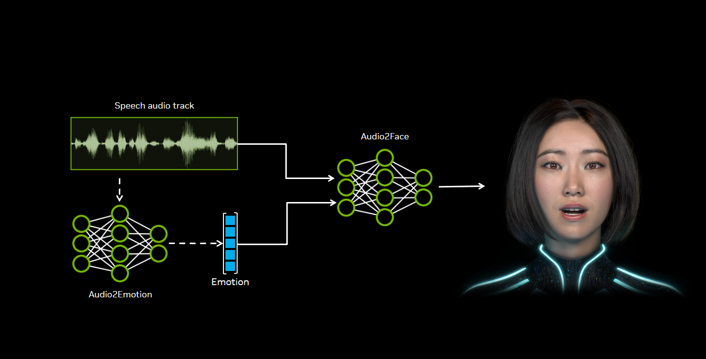
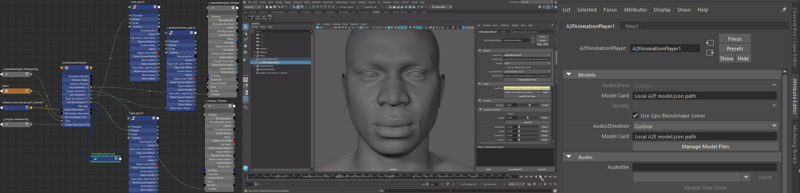

# NVIDIA Audio2Face-3D

Audio2Face-3D is an advanced technology that generates high-fidelity 3D facial animation from an audio source, supporting both pre-recorded files and real-time streams.

The system analyzes vocal data to synthesize detailed and realistic articulation. This includes the precise, synchronized motion of the jaw, tongue, and eyes, as well as the subtle deformations of the facial skin. This comprehensive approach results in two key outputs:

- Accurate lip-sync based on phonetic analysis.
- Nuanced emotional expression inferred from the tone of the speech.

Together, these elements produce a complete and lifelike facial performance that matches the source audio. Audio2Face-3D drives a character's facial performance through direct mesh deformations, joint transformations, or blend shape weights.

This page serves as the central hub for all official Audio2Face-3D technologies and tools, including pre-trained models, the development SDK, plugins for Autodesk Maya and Unreal Engine 5, as well as sample datasets. 

## Audio2Face-3D Collection

The Audio2Face-3D collection is distributed across several platforms. The collection offers the following components:

- **NVIDIA Repositories:** Access source code, helper scripts, packaged builds, and documentation.

- **Hugging Face Hub:** Download pre-trained models and sample training datasets.

## NVIDIA Repositories

<table align="center">
  <tr>
    <th>
Package
</th>
    <th>
Use
</th>
    <th>
Format
</th>
    <th>
License
</th>
    <th>Info</th>
  </tr>
  <tr>
    <td align="center"><b>Audio2Face-3D SDK</b></td>
    <td align="left">Authoring and runtime facial animations on-device or in the cloud.</td>
    <td align="left">Source Code - C++ & Python</td>
    <td align="left">MIT</td>
    <td align="center"><a href="#audio2face-3d-sdk">More</a></td>
  </tr>
  <tr>
    <td align="center"><b>Audio2Face-3D Training Framework</b></td>
    <td align="left">Framework (v1.0) for creating Audio2Face-3D models with your data.</td>
    <td align="left">Source Code - Python & Docker Container</td>
    <td align="left">Apache</td>
    <td align="center"><a href="#audio2face-3d-training-framework">More</a></td>
  </tr>
  <tr>
    <td align="center"><b>Maya ACE (MACE)</b></td>
    <td align="left">Animation authoring plugin with local execution (v2.0).</td>
    <td align="left">Autodesk Maya Plugin Module, Source Code C++, and Python</td>
    <td align="left">MIT</td>
    <td align="center"><a href="#maya-ace-plugin-mace">More</a></td>
  </tr>
  <tr>
    <td align="center"><b>Unreal Engine 5 plugin</b></td>
    <td align="left">Unreal Engine 5 plugin (v2.5) for UE 5.5 and UE 5.6 game engine workflows.</td>
    <td align="left">Unreal Engine (.uplugin) & Source Code C++</td>
    <td align="left">MIT</td>
    <td align="center"><a href="#audio2face-3d-unreal-engine-5-plugin">More</a></td>
  </tr>  
  <tr>
    <td align="center"><b>Audio2Face-3D NIM</b></td>
    <td align="left">Simplifies the large-scale deployment of Audio2Face-3D models.</td>
    <td align="left">Docker Container</td>
    <td align="left"><a href="https://www.nvidia.com/en-us/agreements/enterprise-software/product-specific-terms-for-ai-products/">NVIDIA Software License Agreement and Product Specific Terms for AI Products</a></td>
    <td align="center"><a href="#audio2face-3d-nim">More</a></td>
  </tr>   
</table>

## Hugging Face Hub

<table align="center">
  <tr>
    <th>
Package
</th>
    <th>
Use
</th>
    <th>
Format
</th>
    <th>
License
</th>
    <th>
Links
</th>
  </tr>
  <tr>
    <td align="center"><b>Audio2Face-3D Models</b></td>
    <td align="left">Regression (v2.3) and diffusion (v3.0) pre-trained models for generating lip-sync.</td>
    <td align="left">Open Weights / onnx-trt</td>
    <td align="left">Nvidia Open Model</td>
    <td align="center"><a href="https://huggingface.co/nvidia/Audio2Face-3D-v3.0">v3.0</a> 
    <a href="https://huggingface.co/nvidia/Audio2Face-3D-v2.3-Mark">Mark v2.3</a> 
    <a href="https://huggingface.co/nvidia/Audio2Face-3D-v2.3.1-Claire">Claire v2.3.1</a> 
    <a href="https://huggingface.co/nvidia/Audio2Face-3D-v2.3.1-James">James v2.3.1</a></td>
  </tr>
  <tr>
    <td align="center"><b>Audio2Emotion Models</b></td>
    <td align="left">Production (v2.2) and experimental (v3.0) models to infer emotional state from audio.</td>
    <td align="left">Open Weights / onnx-trt</td>
    <td align="left">Custom (use allowed with Audio2Face only)</td>
    <td align="center"><a href="https://huggingface.co/nvidia/Audio2Emotion-v2.2">v2.2</a> 
    <a href="https://huggingface.co/nvidia/Audio2Emotion-v3.0">v3.0</a></td>
  </tr>  
  <tr>
    <td align="center"><b>Audio2Face-3D Training Sample Data</b></td>
    <td align="left">Example dataset to get started with the training framework.</td>
    <td align="left">Audio files, blendshape data, animated geometry caches, geometry files, and transform files.</td>
    <td align="left">Custom (evaluation only)</td>
    <td align="center"><a href="https://huggingface.co/datasets/nvidia/Audio2Face-3D-Dataset-v1.0.0-claire">Claire Dataset v1.0.0</a></td>
  </tr>  
</table>

## Audio2Face-3D SDK

**Target audience:** C++ developers, tools & pipeline engineers

**Link:** [A2X SDK on Github](https://github.com/NVIDIA/Audio2Face-3D-SDK)

The Audio2Face-3D SDK is a powerful C++ library designed for developers who need to integrate Audio2Face-3D's real-time inference capabilities directly into their own software. It provides the necessary tools to build custom applications, plugins, or batch processing tools that can generate high-quality facial animation data from an audio source using any compatible Audio2Face-3D model.

**Key Features**

- Cross-Platform C++ Library: Ensures wide compatibility across different operating systems.
- Real-Time Performance: Highly optimized for low-latency inference suitable for interactive applications.
- Hardware Acceleration: Leverages NVIDIA GPUs for maximum performance, with a CPU fallback for broader hardware support.

**Best Use Cases**

- Game Development: Integrate real-time facial animation for in-game character dialogue and cinematics.
- Custom Applications: Add Audio2Face-3D functionality to proprietary content creation tools.
- Production Deployment: Build scalable, automated facial animation pipelines for games, films, or broadcast.

## Audio2Face-3D Training Framework

**Target audience:** 3D animators, animation technical and art directors, Python scripters, ML researchers

**Link:** [Audio2Face-3D Training Framework on Github](https://github.com/NVIDIA/Audio2Face-3D-training-framework)

The Audio2Face-3D Training Framework provides the complete toolset required to create custom, high-performance facial animation models from your own datasets. This is the same powerful framework used by NVIDIA to train the official Mark, Claire, and James pre-trained models. 

By training on your own character's lip-synced animations, you can generate models that perfectly capture a desired performance style, personality, or language. A provided sample dataset helps users understand the complete workflow from data preparation to a fully trained model.

**Key Features**

- Custom Model Training: Train unique Audio2Face-3D models from scratch on your proprietary data.
- Flexible Environment: A Python-based framework distributed via Docker for consistent and reproducible setups.
- Multi-Language Support: Natively supports training on custom datasets in single or multiple languages.
- Standardized Output: Exports trained models along with a JSON model card for seamless integration with other Audio2Face tools.

**Best Use Cases**

- Develop unique models that capture a character's specific personality and performance style.
- Create language-specific models to support multilingual dialogue and localization.
- Build highly specialized models to meet unique research, pipeline, or production requirements.

## Maya ACE Plugin (MACE)

**Target audience:** 3D animators, animation technical directors, Python scripters

**Link:** [Maya ACE on Github](https://github.com/NVIDIA/Maya-ACE)

MACE is a comprehensive plugin that integrates the full power of Audio2Face-3D directly within the Autodesk Maya environment.

It provides an intuitive user interface for generating real-time facial animation from an audio source, with the flexibility to output to direct mesh deformations, object transformations, or blend shape weights. A key feature is its ability to load any compatible Audio2Face model via its JSON model card, supporting both pre-trained and custom-trained models. For advanced integration, the plugin's nodes are editable within Maya, and sample scripts are provided to demonstrate how its functionality can be extended.

**Key Features**

- Real-Time Feedback: Generate and preview facial animation directly in the Maya viewport.
- Flexible Inference: Supports both local inference on the user's machine and remote inference by connecting to an Audio2Face-3D microservice.
- Audio2Face-3D Model Support: Load any compatible Audio2Face-3D model using its JSON model card.
- Production-Ready Export: Export the final animation as native Maya keyframes or in the FBX format for use in other applications.
- Artist-Friendly User Interface (UI): Fully integrated into the Maya UI, requiring no coding for standard operations.

**Best Use Cases**

- 3D Animators: Rapidly create high-quality facial animation and iterate on performances.
- Technical Artists: Create and test inference configurations and integrate Audio2Face-3D into a studio pipeline.
- Directors & Supervisors: Conduct quick previs and real-time reviews of animated dialogue.
- Animation Pipeline: Create configuration files for using in batch pipelines or Audio2Face-3D NIM deployments.

## Audio2Face-3D Unreal Engine 5 Plugin

**Target audience:** games developers using Unreal Engine 5

**Links:**

* [ACE Unreal 5.6 Plugin](https://developer.nvidia.com/downloads/assets/ace/nv_ace_reference-ue5.6-v2.5.0rc3.zip)
* [ACE Unreal 5.5 Plugin](https://developer.nvidia.com/downloads/assets/ace/nv_ace_reference-ue5.5-v2.5.0rc3.zip)
* [ACE Unreal 5.4 Plugin](https://developer.nvidia.com/downloads/assets/ace/nv_ace_reference-ue5.4-v2.4.0.zip)
* [Audio2Face-3D 3.0 Models Plugin](https://developer.nvidia.com/downloads/assets/ace/ace_3.0_a2f_models.zip)
* [Audio2Face-3D 2.3 Models Plugin](https://developer.nvidia.com/downloads/assets/ace/ace_2.5_v2.3_a2f_models.zip)
* [Unreal Sample Project](https://developer.nvidia.com/downloads/assets/ace/aceunrealsample-1.0.0.7z)

The Audio2Face-3D Plugin for Unreal Engine 5 brings real-time, AI-driven facial animation directly into your game development and virtual production workflows.

It's integrated into the editor via Blueprint nodes, allowing artists to easily connect the animation data to any character's facial rig. A comprehensive sample project is provided to demonstrate a complete setup, including a pre-configured mapping for Epic Games' MetaHumans.

This solution requires two components to be installed: the core ACE Unreal plugin and the Audio2Face-3D Models plugin, as listed above. 

**Key Features**

- Real-Time Animation: Drive character facial rigs directly within the Unreal Engine editor from an audio source.
- Blueprint Integration: Provides an artist-friendly workflow through Blueprints, requiring no C++ coding for standard use.
- Flexible Inference: Supports both local inference on your machine and remote inference from a separate server.
- MetaHuman Ready: The included sample project demonstrates how to rig and animate a MetaHuman character.
- Extensible Source Code: The full C++ source code is available for developers who wish to modify or extend the plugin's functionality.

**Best Use Cases**

- Game Developers: Create dynamic, audio-driven facial animation for NPCs and player characters.
- Virtual Production & Cinematics: Rapidly generate facial performances for real-time filmmaking and previs.

## Audio2Face-3D NIM

**Target audience:** Linux systems administrators, cloud & devops engineers

**Link:** [A2F NIM on build.nvidia.com](https://build.nvidia.com/nvidia/audio2face-3d)

The Audio2Face NIM (NVIDIA Inference Microservice) is a scalable, containerized microservice designed for large-scale and multi-user deployments. It exposes the full functionality of the Audio2Face-3D inference engine via the high-performance gRPC protocol, allowing multiple client applications to connect simultaneously and generate real-time facial animation.

This architecture is ideal for a variety of production workflows, from powering interactive web avatars to serving as a centralized animation tool for an entire studio.

**Key Features**

- Large-Scale Deployment: Built to serve concurrent inference requests in a demanding production environment.
- Multi-Stream Support: Capable of processing multiple simultaneous audio streams for different users or applications.
- High-Performance Communication: Utilizes the gRPC protocol for low-latency and robust client-server communication.
- Centralized Resource: Allows powerful GPU hardware to be centralized on a server, making Audio2Face accessible to users on less powerful client machines.

**Best Use Cases**

- Web & Cloud Applications: Powering interactive, web-based digital humans and cloud-native services.
- Multi-Platform Runtime: Providing a backend for real-time animation inference in games and applications across various platforms (for example, mobile or consoles).
- Studio Animation Services: Creating a central Audio2Face-3D service for a team of animators, democratizing access to the technology.
- Automated Batch Processing: Serving as a high-throughput rendering service for generating thousands of animations in a large production pipeline.
